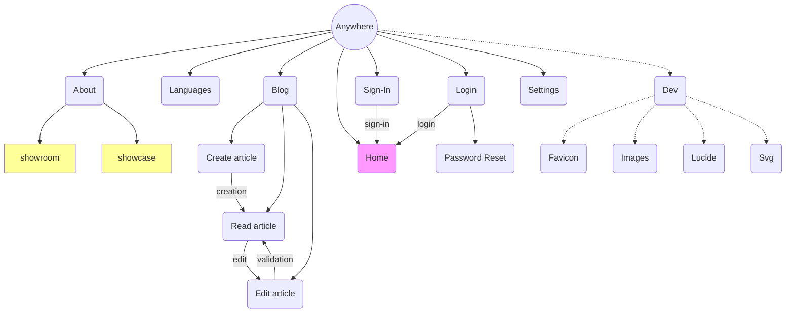

```mermaid
graph TD
    anywhere --> about(About)
    about --> showroom
    about --> showcase
    anywhere --> languages(Languages)
    anywhere --> blog(Blog)
    blog --> blog-create(Create article)
    blog --> blog-read(Read article)
    blog --> blog-edit(Edit article)
    blog-create -->|creation| blog-read
    blog-read -->|edit| blog-edit
    blog-edit -->|validation| blog-read
    anywhere((Anywhere)) --> home(Home)
    anywhere --> sign-in(Sign-In)
    anywhere --> login(Login)
    sign-in -->|sign-in| home
    login -->|login| home
    login --> password-reset(Password Reset)
    anywhere --> settings(Settings)

    anywhere -.-> dev(Dev)
    dev -.-> favicon(Favicon)
    dev -.-> img(Images)
    dev -.-> lucide(Lucide)
    dev -.-> svg(Svg)

    style home fill:#f9f
    style showroom fill:#ff9
    style showcase fill:#ff9
```
